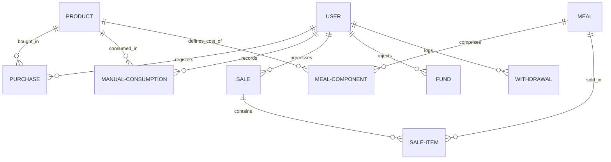

# Officers' Kitchen Cashier & Inventory System (نظام إدارة مطبخ ومخزن ضباط قوات الأمن)

A localized, secure, and lightweight offline-first cashier, inventory, and financial management application designed specifically for the **Officers' Kitchen of the Security Forces Administration in Matrouh, Egypt**.

Developed under the patronage and leadership of:
* **Colonel / Hazem Al-Tamimi** (Director of Matrouh Security Forces Administration)
* **System Developer (Conscript Soldier) / Mahmoud Mohamed Zakaria** (Batch 7/2025)

---

## 📖 Table of Contents
1. [Project Overview](#-project-overview)
2. [Key Features](#-key-features)
3. [Architecture & Database Schema](#-architecture--database-schema)
4. [Tech Stack](#-tech-stack)
5. [File Structure](#-file-structure)
6. [Getting Started](#-getting-started)
   - [Prerequisites](#prerequisites)
   - [Installation](#installation)
   - [Configuration](#configuration)
   - [Running the Application](#running-the-application)
7. [Chrome Kiosk Mode & Automated Printing](#-chrome-kiosk-mode--automated-printing)

---

## 🔍 Project Overview
The **Officers' Kitchen Cashier & Inventory System** is a self-contained, localized web application that operates as a desktop-like POS (Point of Sale) and inventory manager. Institutional kitchens handle significant quantities of raw ingredients, which must be tracked against meals sold or distributed. 

This application bridges the gap by:
* Mapping multi-ingredient recipes (meals) directly to the raw warehouse materials.
* Deducting the exact ingredient weights from the warehouse stock automatically when a sale is finalized.
* Tracking safe balances (cash-in-hand) by linking every purchase, sale, deposit, and withdrawal.
* Offering automated printing capabilities optimized for thermal receipt and normal printers.

---

## ✨ Key Features

### 🛒 1. Cashier & Point of Sale (POS)
* **Order Entry**: Cashiers can build orders by selecting menu meals, adding transaction notes, and setting the sale type.
* **Pre-Sale Stock Validation**: The system calculates the aggregate raw materials needed for the entire order and blocks the transaction if the warehouse has insufficient stock.
* **Flexible Sale Types**: Supports normal sales, returns (which automatically refund cash from the safe and return ingredients to the warehouse), and damage records.
* **Instant Receipt Generation**: Automatically formats and opens print layouts for high-speed ticket printing.

### 📦 2. Warehouse & Inventory Management
* **Raw Materials Stocktaking**: Monitor inventory levels, unit types (e.g., kilograms, liters, pieces, packets), and buying prices.
* **Manual Material Dispensation**: Discharge raw ingredients manually from stock (e.g., for kitchen testing, general kitchen usage, or waste/damage) and associate each event with a logging user.
* **Real-time Inventory Valuation**: View the total monetary value of ingredients stored in the warehouse based on dynamic unit prices.

### 🍽️ 3. Menu & Recipe Creator
* **Composite Menu Items**: Construct meal entries where each meal is composed of a list of raw ingredients and specific portions (e.g., a "Kebab Meal" consisting of 0.3 kg Meat, 0.15 kg Rice, and 1 piece of Bread).
* **Automatic Cost Calculation**: Dynamically sums component raw ingredient prices to calculate the production cost of any meal.
* **Margin Optimization**: Visualizes meal selling prices, production costs, and net profit margins to assist in menu adjustment.

### 🏦 4. Cash Drawer (Safe / الخزنة) Management
* **Consolidated Cash Balance**: Automatically increases on normal sales and manual fund injections, and decreases on purchases, refunds, and withdrawals.
* **Manual Audits**: Allows authorized users to register manual fund additions or withdrawals (e.g., administrative expenses or supplier deposits) with explanatory notes.
* **Audited Transaction History**: Every financial modification is logged with timestamps and the originating cashier's identity.

### 📊 5. Advanced Periodical Reports
* **Custom Reporting Ranges**: Query transactions and stock metrics using specific from-to date selectors.
* **COGS & Profit Statistics**: Get summaries of total sales, total raw materials cost (COGS), and overall net profits.
* **Ingredient Utilization Details**: View the exact cumulative quantity and cost of each ingredient consumed over a selected period.
* **Warehouse Ledger Movement**: Audit warehouse activity showing starting balances, purchases, consumption, and final stock balances.

---

## 🏛️ Architecture & Database Schema
The project uses the Model-View-Controller (MVC) paradigm. The database runs on **SQLite** with the following entity relations managed through **SQLAlchemy**:



### Primary Database Models:
1. **`User`**: System access credentials (hashed using `scrypt`).
2. **`Product`**: Tracks individual raw ingredients, unit types, quantity, and unit cost.
3. **`Purchase`**: Audits ingredient procurement, cost, quantities, and ordering date.
4. **`ManualConsumption`**: Logs non-sale ingredient usage.
5. **`Meal`**: Menu item metadata and set customer pricing.
6. **`MealComponent`**: Links meals and raw ingredients with specified weights.
7. **`Sale`**: High-level details of sales tickets (order number, customer total, notes, sale type).
8. **`SaleItem`**: Connects individual sold meals to a parent sale receipt.
9. **`Safe`**: Keeps track of current cash reserves.
10. **`Fund` & `Withdrawal`**: Logs manual safe cash adjustments.

---

## 🛠️ Tech Stack

### Backend
* **Python 3.x**: Primary programming language.
* **Flask**: Lightweight framework chosen for routing simplicity and local microservice capability.
* **SQLAlchemy (Flask-SQLAlchemy)**: Object-Relational Mapper (ORM) ensuring SQL Injection defense and database interaction layer abstraction.
* **Waitress**: Production-ready WSGI server designed for Windows host machines.
* **python-dotenv**: Loads dynamic credentials and settings files (`.env`).
* **Flask-Migrate**: Automates schema migration scripts using Alembic.

### Frontend
* **HTML5 / CSS3 / JavaScript (ES6)**: Standard client browser stack.
* **Bootstrap 5 (RTL)**: Responsive layout grid configured for Right-to-Left Arabic text alignment.
* **Jinja2**: Server-side template rendering for fast, secure dynamic page loads.

### Database
* **SQLite**: Embedded database stored locally as a single file, removing external database server setup overhead.

---

## 📂 File Structure
```
Cashier-App-for-a-Restaurant-main/
│
├── app.py                      # Core web app, routing endpoints, and SQLAlchemy models
├── config.py                   # Environment-specific configuration classes
├── requirements.txt            # Python dependencies lists
├── run_app.bat                 # Windows shell launcher script
├── .gitignore                  # Git excluded file rules
│
├── static/                     # Web UI Static Assets
│   ├── css/
│   │   ├── bootstrap.rtl.min.css  # RTL adapted Bootstrap 5 CSS
│   │   └── style.css              # Custom themes, color palettes, and print overrides
│   ├── js/
│   │   └── bootstrap.bundle.min.js # Bootstrap interactive components JS
│   ├── fonts/                  # Custom fonts supporting clean Arabic text
│   └── images/                 # Logo and brand images (e.g., logo.png)
│
└── templates/                  # Jinja2 HTML Layouts
    ├── base.html               # Shared layout structure, navigation bar, and footer credits
    ├── index.html              # Main dashboard overview (financial indicators)
    ├── login.html              # Cashier login portal
    ├── signup.html             # New operator signup portal
    ├── products.html           # Real-time warehouse inventories view
    ├── purchases.html          # Material procurement tracking
    ├── consume.html            # Manual material discharge screen
    ├── menu.html               # Recipe configurations & meal pricing
    ├── sales.html              # Interactive cashier terminal
    ├── safe.html               # Safe box auditing (credits & debits)
    ├── report.html             # COGS, profit, and ingredient reports screen
    ├── receipt.html            # Customer printer receipt layout
    └── *_print.html            # Minimal print styles for reports and receipts
```

---

## 🚀 Getting Started

### Prerequisites
* **Python 3.8+** installed.
* **Google Chrome** browser (crucial for auto-printing functionality).

### Installation
1. Clone this repository to your computer:
   ```bash
   git clone https://github.com/your-username/Cashier-App-for-a-Restaurant.git
   cd Cashier-App-for-a-Restaurant
   ```

2. Create a clean Python virtual environment:
   ```bash
   python -m venv venv
   ```

3. Activate the virtual environment:
   * **Windows CMD**:
     ```cmd
     venv\Scripts\activate.bat
     ```
   * **Windows PowerShell**:
     ```powershell
     .\venv\Scripts\Activate.ps1
     ```
   * **Linux/macOS Terminal**:
     ```bash
     source venv/bin/activate
     ```

4. Install the required libraries:
   ```bash
   pip install -r requirements.txt
   ```

### Configuration
Create a file named `.env` (or `.env.prod` for production deployment) in the root directory:
```ini
SECRET_KEY=enter-a-highly-secure-secret-key-here
FLASK_ENV=production
SQLALCHEMY_DATABASE_URI=sqlite:///matbakh_elshorta.db
```

### Running the Application

#### **Development Server**
Run the server manually using Python:
```bash
python app.py
```
This runs the application locally on `http://127.0.0.1:8000` in developer mode.

#### **Production Server (Windows Startup Script)**
Double-click the **`run_app.bat`** script or run it through CMD:
```cmd
run_app.bat
```
*This launches the Python server in the background using Waitress and fires Chrome in kiosk-printing mode pointing to the cashier panel.*

---

## 🖥️ Chrome Kiosk Mode & Automated Printing

The application contains specific switches inside `run_app.bat` that configure Google Chrome to behave as a dedicated cashier terminal:

```cmd
start "" "C:\Program Files\Google\Chrome\Application\chrome.exe" --kiosk --kiosk-printing http://127.0.0.1:8000
```

### Flags Explanation:
* **`--kiosk`**: Opens the browser in true full-screen mode, removing window borders, the URL address bar, bookmarks, and tabs. This locks down the cashier terminal so users can only interact with the application.
* **`--kiosk-printing`**: Disables the Chrome print preview dialog. When the cashier clicks **Print** (طباعة), the system bypasses prompt approvals and sends the receipt directly to the operating system's default printer.

> 📝 **Note**: To ensure seamless receipt printing, set your physical thermal receipt printer as the **Default Printer** in your Windows Control Panel before launching the application.
